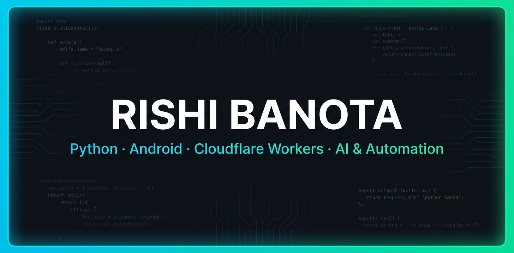

# Hi 👋 I'm Rishi Banota

<!-- 

  

 -->

  

  
  
  

## 🚀 About Me

- 🌐 **Live Portfolio & Project Directory:** [rishibanota.github.io/rishibanota](https://rishibanota.github.io/rishibanota/)
- 🎓 BE IT Student
- 🐍 Python Developer
- 📱 Android App Developer
- ☁️ Building with Cloudflare Workers
- 🤖 Interested in Automation & AI
- 🌱 Always learning and building new projects

## 🛠 Tech Stack

## ⭐ Featured Projects

- 💻 Bugseer (Bug Auditor)
- 🌐 ToolMint Website (145+ Daily Use Tools)
- 🛒 TryKaro (Search 40+ Stores in One Query)
- 🎮 Code Arcade (Coding Game to Develop Coding Skills)
- 💹 Crypto Stock Scanner (Delta Exchange Coins Scanner)

## ◈ GitHub Stats `📊`

## 🐍 Contributions

<picture>
  <source
    media="(prefers-color-scheme: dark)"
    srcset="https://raw.githubusercontent.com/rishibanota/rishibanota/output/github-contribution-grid-snake-dark.svg">
  <source
    media="(prefers-color-scheme: light)"
    srcset="https://raw.githubusercontent.com/rishibanota/rishibanota/output/github-contribution-grid-snake.svg">
  
</picture>

---

## 💡 Have an App/Tool Idea?

Got an idea for an app, website, or developer tool?

📩 **[Send me your idea →](https://mail.google.com/mail/?view=cm&fs=1&to=rishibanota837@gmail.com)**

I’d love to hear your ideas and turn interesting ones into projects! 🚀

## 🖥️ Help Me Build My Development PC

My current laptop struggles with development workloads and is holding back the projects I want to build. I’m raising funds for a proper development workstation for coding, compiling, AI tools, 3D development, and other demanding workloads.

❤️ **Want to support my development journey?**

👉 **[Help me build my PC →](https://build-me-a-pc.vercel.app/)**

Every contribution goes toward the PC build and helps me build bigger and better projects.

---

⭐ Thanks for visiting my profile!

<!-- Achievements: Pair Extraordinaire co-author test -->
<!-- YOLO achievement test -->
